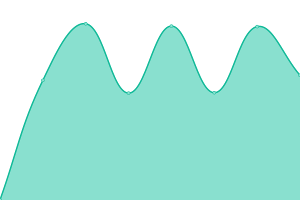
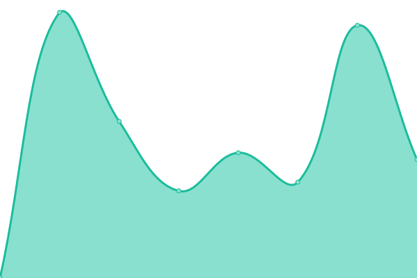

# [📈 Live Status](https://mrejonas.github.io/websitemonitoring): <!--live status--> **🟩 All systems operational**

This repository contains the open-source uptime monitor and status page for [mrejonas](https://mrejonas.github.io/websitemonitoring), powered by [Upptime](https://github.com/upptime/upptime).

With [Upptime](https://upptime.js.org), you can get your own unlimited and free uptime monitor and status page, powered entirely by a GitHub repository. We use [Issues](https://github.com/mrejonas/websitemonitoring/issues) as incident reports, [Actions](https://github.com/mrejonas/websitemonitoring/actions) as uptime monitors, and [Pages](https://mrejonas.github.io/websitemonitoring) for the status page.

<!--start: status pages-->
<!-- This summary is generated by Upptime (https://github.com/upptime/upptime) -->
<!-- Do not edit this manually, your changes will be overwritten -->
<!-- prettier-ignore -->
| URL | Status | History | Response Time | Uptime |
| --- | ------ | ------- | ------------- | ------ |
|  [SADaCC](https://sadacc.org) | 🟩 Up | [sa-da-cc.yml](https://github.com/mrejonas/websitemonitoring/commits/HEAD/history/sa-da-cc.yml) | 

 3214ms
     
 | 

<a href="https://mrejonas.github.io/websitemonitoring/history/sa-da-cc">76.80%</a>
    

|  [SIA](https://www.sickleinafrica.org) | 🟩 Up | [sia.yml](https://github.com/mrejonas/websitemonitoring/commits/HEAD/history/sia.yml) | 

 588ms
     
 | 

<a href="https://mrejonas.github.io/websitemonitoring/history/sia">76.82%</a>
    

|  [APN](https://www.aphgn.org/) | 🟩 Up | [apn.yml](https://github.com/mrejonas/websitemonitoring/commits/HEAD/history/apn.yml) | 

 1381ms
     
 | 

<a href="https://mrejonas.github.io/websitemonitoring/history/apn">100.00%</a>
    

|  [AfSHG](https://afshgmeetings.org/) | 🟩 Up | [af-shg.yml](https://github.com/mrejonas/websitemonitoring/commits/HEAD/history/af-shg.yml) | 

 1267ms
     
 | 

<a href="https://mrejonas.github.io/websitemonitoring/history/af-shg">100.00%</a>
    

|  [SCD Warriors](http://scdwarriorsafrica.org/) | 🟩 Up | [scd-warriors.yml](https://github.com/mrejonas/websitemonitoring/commits/HEAD/history/scd-warriors.yml) | 

 1168ms
     
 | 

<a href="https://mrejonas.github.io/websitemonitoring/history/scd-warriors">26.56%</a>
    

<!--end: status pages-->

[**Visit our status website →**](https://mrejonas.github.io/websitemonitoring)

## 📄 License

- Powered by: [Upptime](https://github.com/upptime/upptime)
- Code: [MIT](./LICENSE) © [mrejonas](https://mrejonas.github.io/websitemonitoring)
- Data in the `./history` directory: [Open Database License](https://opendatacommons.org/licenses/odbl/1-0/)
